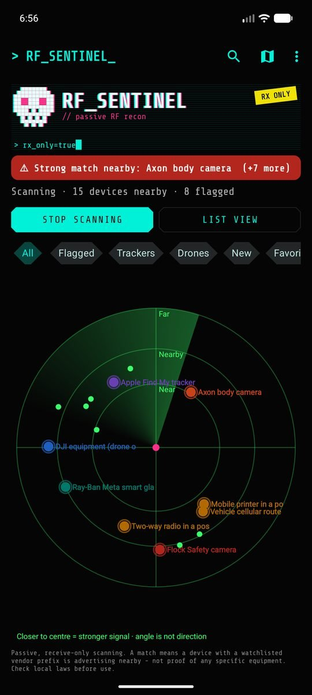

<h1 align="center">RF Sentinel</h1>
<h3 align="center">BLE &amp; WiFi Police Scanner for Android</h3>

<p align="center">
  Passively detects body cameras, license-plate cameras, drones, trackers and other
  surveillance equipment from the Bluetooth and WiFi signals they broadcast.
</p>

<p align="center">
  <b>A free, open-source alternative to SØPHIA (s0phia ops / SophiaOps)</b> -
  a regular Android app, no Termux, no account, no subscription.
</p>

<p align="center">
  <a href="https://github.com/CIS-C0/RFSentinel/releases/latest"></a>
  
  
  
  
  <a href="LICENSE"></a>
  <a href="https://github.com/CIS-C0/RFSentinel/stargazers"></a>
</p>

<p align="center">
  <a href="https://github.com/CIS-C0/RFSentinel/releases/latest"></a>
</p>

<p align="center">
  
  &nbsp;&nbsp;
  
</p>
<p align="center">
  
</p>
<p align="center"><sub>List and radar views (DedSec theme), and the Android Auto live map with navigation. Demo data. <a href="#themes">See all 12 themes</a> · <a href="#android-auto">Android Auto</a>.</sub></p>

<p align="center">
  <a href="https://github.com/CIS-C0/RFSentinel/stargazers"></a>
</p>

---

## Contents

- [Overview](#overview)
- [Features](#features)
- [Installation](#installation)
- [Usage](#usage)
- [Android Auto](#android-auto)
- [Themes](#themes)
- [Privacy](#privacy)
- [Limitations](#limitations)
- [Building from source](#building-from-source)
- [Signatures and sources](#signatures-and-sources)
- [Acknowledgements](#acknowledgements)
- [License](#license)
- [Disclaimer](#disclaimer)

## Overview

RF Sentinel is a non-rooted Android app that listens to Bluetooth LE
advertisements and WiFi beacons. It lists every device around you with its
vendor, type and signal strength, and flags law-enforcement and surveillance
equipment.

Looking for a **free SØPHIA / s0phia ops alternative**? RF Sentinel does the same
kind of passive BLE and WiFi signal scanning (police gear, hidden cameras,
trackers, drones) as a normal installable APK: open source under GPL-3.0, fully
offline apart from optional map data, with Android Auto support. *RF Sentinel is
an independent project, not affiliated with SØPHIA or DetecX.*

What it flags:

| Category | Examples |
|---|---|
| Body cameras | Axon, Motorola / WatchGuard, Digital Ally, Zepcam, Vievu, Utility, Getac, police in-car video |
| License-plate readers | Flock Safety, Genetec, Perceptics, Quercus, Tattile, speed and red-light cameras |
| Audio sensors | Flock Raven |
| Public-safety gear | P25 / TETRA radios, police radar, vehicle upfit, e-ticket printers, cell-site simulator and forensic makers |
| Drones | Remote ID decoded (serial, position, altitude, operator location) |
| Trackers | AirTags and other Find My / Find Hub trackers that follow you |
| Camera glasses | Ray-Ban Meta, Snap Spectacles, Vuzix and others |

It never transmits anything. It only reads what devices already broadcast
publicly.

## Features

**Detection**
- Payload signatures, vendor prefixes (IEEE MA-L/M/S) and Bluetooth SIG identifiers, each with a confidence tier: weak, probable or strong
- Evidence fusion: independent matches on the same device strengthen each other
- Patrol-vehicle detection: several kinds of police-type equipment whose signals move together are flagged as a possible police vehicle
- Address-rotation linking: follows a device when its Bluetooth address changes
- Follower alerts: a warning when a tracker or flagged device keeps moving with you
- **Known plate, speed and red-light cameras:** the cameras mapped in OpenStreetMap (plate readers e.g. by DeFlock, fixed speed and red-light cameras) appear on the map by themselves for the area you look at, and you're warned as you approach one - even the cellular-only cameras no radio scan can detect. Speed cameras warn about 30 seconds ahead, with the limit when it's mapped. Areas are kept offline and refreshed weekly; the setup wizard (and Settings) can pre-download everything within ~100 km of you
- **Drones:** live map of each Remote ID drone with its heading, altitude, speed and operator, plus a "drone overhead" alert
- **Fake cell tower signs (IMSI catchers):** warnings for test network codes, forced 2G downgrades, unexpected networks and other classic signs (heuristic, no root needed)
- Editable watchlist with exact addresses, vendor prefixes, and name or vendor rules, plus regional presets (Global, Canada, US)

**Identification**
- Ordinary devices named precisely: exact AirPods/Beats model, device class from standard Bluetooth services, IEEE registrant
- WiFi access points, including hidden networks, identified from WPS data, Cisco AP names and vendor elements, and linked to visible networks on the same router
- Decoded Apple Continuity, iBeacon, Eddystone, Fast Pair and ASTM F3411 Remote ID

**Interface**
- Live list and radar view, with filters and search
- Device details: evidence, identity, signal graph, **Locate** mode, history and raw advertisement
- OpenStreetMap map with recorded GPS traces and the devices heard along them
- **History map & timeline:** a heatmap of where flagged equipment showed up, and when (hour of day, day of week)
- Alerts with sound, vibration patterns and spoken announcements, plus a discreet mode
- **Floating threat bubble** over Waze, Google Maps or any other app while scanning
- **Starts by itself in the car** (your car's Bluetooth or Android Auto) and stops when you leave
- Android Auto app with a map of nearby cameras and drones, Quick Settings tile and home-screen widget
- **Report unknown device:** share a privacy-safe signature (no full address, serials, location or times) so new equipment can be added
- 12 themes, each styled theme with its own animated header

**Data**
- Export as CSV, JSON, KML, GPX or GeoJSON
- Everything stays on the phone

## Installation

Requires **Android 8.0 or newer**.

1. On your phone, tap **Download the app** above, or open the [latest release](https://github.com/CIS-C0/RFSentinel/releases/latest).
2. Under **Assets**, tap the file ending in **`-release.apk`**. Don't pick the "Source code" archives.
3. Open the downloaded file from the notification, or from **Files → Downloads**.
4. If Android blocks it as an unknown source, tap **Settings**, enable **Allow from this source**, go back and tap **Install**.
5. Open **RF Sentinel**. A short setup wizard walks you through theme, region, alerts and permissions.

To update, install the newer APK over the existing one. Your history and settings are kept.

## Usage

Tap **Start scanning** and grant location and *Nearby devices*. The notification
permission is optional; without it, alerts still play and show in the app.

### Main screen

- **Threat banner:** shows all clear, weak, probable or strong, or *may be following you*.
- **Live list:** every device heard in the last 3 minutes, with vendor, type,
  radio, signal, rough distance, and NEW / ★ / FOLLOWING badges. Flagged
  devices sort first and flash in their category colour. Matches above your
  alert threshold play a sound and vibrate: one pulse for weak, two for
  probable, three for strong.
- **Radar view:** closer to the centre means a stronger signal. The angle is
  not a direction, because a phone can't measure one.
- **Filters and search:** All, Flagged, Trackers, Drones, New, Favorites,
  Bluetooth, WiFi. Search matches name, address, vendor and type.
- **Tap** a device for details. **Long-press** for quick actions: watchlist,
  whitelist, favorite, copy, and **Report unknown device** for devices with no
  match. The report shows exactly what is shared (vendor prefix, name pattern
  with serial digits hidden, service and manufacturer IDs) before you send it;
  paste it into a [new issue](https://github.com/CIS-C0/RFSentinel/issues/new).
- **Floating bubble** (Settings, needs *Display over other apps*): green when
  clear, orange for a probable match, red for a strong match or a follower,
  with the number of flagged devices. Tap to open the app, drag to move.
- **In the car** (Settings → *Start scanning automatically in the car*): pick
  your car's Bluetooth; scanning starts when the phone connects to it or to
  Android Auto, and stops when you leave if the car started it.

### Device details

The app never connects to a device. The details screen shows:
- why the device is flagged: each signature with its evidence and source
- identity and how it was determined
- address type and whether the device is trackable
- decoded protocol data
- WiFi band, channel, standard and security
- drone Remote ID, with the drone and operator positions openable in your maps app
- a live signal graph and **Locate** mode, which beeps faster as you get closer
- history, including past matches and how far the device travelled with you
- the full raw advertisement

### Map and traces

- The **map** (the floating **Map** button on the main screen) shows your
  position, the trace being recorded, and every device heard around you as a dot
  in the same colours as the list and radar, placed where your phone was when its
  signal was strongest. That approximates the device's position, not a fix: only
  precise, fresh GPS fixes are used, and the map switches to GPS while it's open.
  Tap *All devices* to show flagged ones only.
- **Record trace** saves your GPS route and every device heard along it. It
  keeps running with the screen off, and can start automatically with each scan.
- Traces export as **GPX**, **KML**, **GeoJSON** or **CSV**, with all devices or
  flagged ones only.

### Export

Menu → **Export all devices...** or **Export...**:

| Export | Formats |
|---|---|
| Current scan (all devices, matched or not) | CSV, JSON, KML |
| All devices ever seen | CSV, JSON |
| Match log | CSV, JSON, GPX, KML |
| Your watchlist | JSON |
| Everything in one file | JSON |

## Android Auto

RF Sentinel runs in Android Auto as a driver-safe, template-based app:

<p align="center">
  
  
</p>
<p align="center">
  
  
</p>
<p align="center"><sub>Home, flagged devices, live map, and known cameras (demo data).</sub></p>

- **Home screen:** the threat headline, live counts, Start/Stop, and a speaker
  button that mutes or unmutes all alert sound.
- **Device lists** (flagged, drones & trackers, all nearby) and **device details**
  with Whitelist, Watch and Favorite actions. **Navigate** opens your car's
  navigation app for drones with a known position.
- **Live map:** RF Sentinel's own OpenStreetMap map on the car screen, with
  every device heard around you in the list and radar colours, the known plate,
  speed and red-light cameras, and your position. Drag, pinch or use **+ / −** to
  look around; **◎** follows the car again. Needs Android Auto with car API
  level 7 (recent versions); older ones get the car-drawn maps below.
- **Navigation (OpenStreetMap):** *Navigate to...* searches a destination with
  [Nominatim](https://nominatim.org) (only when you submit or tap the search -
  no search-as-you-type), keeps your recent destinations on the phone, and
  plans a driving route with the [OSRM](https://project-osrm.org) demo server.
  The route is drawn on the live map with the next turn, arrival time and
  distance left; turns are spoken, and it re-routes when you leave the route.
  Those servers see the search, your position and destination, and your IP
  address - never your scans.
- **Device and camera lists on the car's map** (also for older Android Auto):
  the devices around you (flagged first) and the closest cameras and drones,
  with distances; tap a camera to centre on it, with **Navigate** to hand it to
  your navigation app.
- **Alerts** appear as a heads-up on the car screen. While connected, they play
  through the car speakers as navigation-guidance audio, briefly lowering your
  music.

Sideloaded apps only appear in Android Auto after one-time setup:
1. Open **Android Auto settings** on your phone.
2. Tap **Version** ten times to unlock developer mode.
3. Open **⋮ → Developer settings** and enable **Unknown sources**.
4. Reconnect to the car.

Still missing? Android Auto only refreshes its app list when an app is installed
or updated. Enable *Unknown sources* first, then install (or reinstall) the APK,
open RF Sentinel once on the phone, and reconnect. Also check **Android Auto
settings → Customize launcher** in case it's listed under hidden apps.

## ESP32 boards on USB (optional)

Plug an ESP32 board into the phone with a USB OTG cable while scanning and
RF Sentinel adds what the board reports to its own detections (allow USB access
on the prompt the first time). Supported firmware:

- **[OUI-Spy](https://github.com/colonelpanichacks/oui-spy-unified-blue)**
  (recommended): its Flock-You, Detector and Sky Spy modes stream every
  detection - Flock cameras, your board's watchlist matches, Remote ID drones
  with their position - as they happen.
- **[GhostESP](https://github.com/GhostESP-Revival/GhostESP)**: the Wi-Fi
  networks it scans, about every 10 seconds (no Bluetooth over USB).

Boards with native USB (ESP32-S2/S3/C3/C6) and those with a CP210x or CH340
USB chip work. RF Sentinel only listens: it never sends OUI-Spy anything, and
only asks GhostESP to scan and list networks. Settings shows the board's
status.

## Themes

Pick a theme in the setup wizard or under **Settings → Appearance**.

| Theme | Look |
|---|---|
| **DedSec** | Hacker street art: pixel skull, self-decrypting title, glitch effects, cut-corner controls |
| **Night Drive** | Red-only cockpit HUD. Every colour is mapped to red to preserve night vision while driving |
| **Night Vision** | Green phosphor image intensifier with grain and a scope vignette |
| **Amber CRT** | 1980s terminal with a blinking cursor and scanlines |
| **Synthwave** | Chrome title, striped sunset and a scrolling wireframe grid |
| **Tactical** | Olive and coyote tan, stencil callsign, Zulu clock and reticle |
| **Blueprint** | Technical drawing on drafting blue |
| **Paper** | Newspaper masthead, the most readable theme in direct sunlight |
| **System / Light / Dark / Material You** | Standard looks. Material You follows your wallpaper colours |

<table>
<tr><td align="center"><br/><sub><b>DedSec</b></sub></td><td align="center"><br/><sub><b>Night Drive</b></sub></td><td align="center"><br/><sub><b>Night Vision</b></sub></td><td align="center"><br/><sub><b>Amber CRT</b></sub></td></tr>
<tr><td align="center"><br/><sub><b>Synthwave</b></sub></td><td align="center"><br/><sub><b>Tactical</b></sub></td><td align="center"><br/><sub><b>Blueprint</b></sub></td><td align="center"><br/><sub><b>Paper</b></sub></td></tr>
<tr><td align="center"><br/><sub><b>System</b></sub></td><td align="center"><br/><sub><b>Light</b></sub></td><td align="center"><br/><sub><b>Dark</b></sub></td><td align="center"><br/><sub><b>Material You</b></sub></td></tr>
</table>

<details>
<summary><b>Radar view in every theme</b></summary>

<table>
<tr><td align="center"><br/><sub><b>DedSec</b></sub></td><td align="center"><br/><sub><b>Night Drive</b></sub></td><td align="center"><br/><sub><b>Night Vision</b></sub></td><td align="center"><br/><sub><b>Amber CRT</b></sub></td></tr>
<tr><td align="center"><br/><sub><b>Synthwave</b></sub></td><td align="center"><br/><sub><b>Tactical</b></sub></td><td align="center"><br/><sub><b>Blueprint</b></sub></td><td align="center"><br/><sub><b>Paper</b></sub></td></tr>
<tr><td align="center"><br/><sub><b>System</b></sub></td><td align="center"><br/><sub><b>Light</b></sub></td><td align="center"><br/><sub><b>Dark</b></sub></td><td align="center"><br/><sub><b>Material You</b></sub></td></tr>
</table>

</details>

<sub>Screenshots use made-up demo devices (debug builds only). They run through the real detection pipeline, so scores, groupings and labels match what the app shows.</sub>

## Privacy

- **Receive-only.** Nothing is transmitted, jammed, spoofed or connected to.
- **No accounts, no cloud, no analytics.** Detections are stored in a local
  database and excluded from cloud backup.
- **Network use is limited to OpenStreetMap:** map tiles while the map is open,
  and the known-camera list for the area you look at on the map (or around you on
  the Android Auto camera map), fetched once per area and refreshed weekly, from
  overpass-api.de or the public mirrors overpass.kumi.systems and
  overpass.private.coffee when it's busy. Those servers see your IP address and
  that area - like the map tiles - never your scans. Turn off *Show known cameras
  automatically* in Settings to fetch only when you tap *Download known cameras*.
  In Android Auto, navigation also uses OpenStreetMap's Nominatim (destination
  search) and the OSRM routing server, only when you search or start a route.
  Map data © OpenStreetMap contributors (ODbL).
- **Data leaves the phone only when you export or share it.**
- **Optional permissions:** *Nearby devices → connect* is asked only to read the
  names of your paired Bluetooth devices when you pick your car; *Display over
  other apps* only for the floating bubble.

## Limitations

- **A match is a signature, not an identification.** `00:25:DF` means "a device
  registered to Axon Enterprise", not "a police officer". Every match shows its
  evidence and a confidence tier. Verify weak matches.
- **Phone radios are weaker than dedicated hardware.** Expect shorter range and
  fewer catches than purpose-built scanners.
- **WiFi scanning is throttled** by Android to about four scans per two minutes.
  The default 30-second interval respects that limit.
- **WiFi only sees access points.** Client devices, such as in-car laptops on
  cellular, are invisible.
- **Signal strength is not distance.** Estimates are often off by 2–3×, and the
  radar angle is not a direction.
- **Screen-off coverage is partial.** With the screen off, Android keeps only a
  filtered scan. That covers payload signatures, trackers, drones, glasses and
  exact-address watchlist entries, but not prefix-only matches.
- **Cellular-only devices are undetectable by radio.** This includes most non-Flock
  license-plate readers and LTE GPS trackers. The known-camera map layer covers plate
  readers that someone has mapped in OpenStreetMap.
- **Fake cell tower checks are heuristic.** Without root, Android shows the cells the
  phone sees but not ciphering or signalling, so each sign has innocent explanations.
  The strongest protection is turning off *Allow 2G* in your SIM settings (Android 12+).
- **Randomized addresses** defeat vendor-prefix matching. Payload signatures and
  address-rotation linking partly compensate.

## Building from source

Requirements: Android Studio, or JDK 17+ with the Android SDK (platform 37).

```bash
./gradlew assembleDebug
```

```bash
./gradlew testDebugUnitTest lintDebug
```

The debug APK is written to `app/build/outputs/apk/debug/`. `tools/gen_assets.py`
regenerates the offline IEEE and Bluetooth SIG databases.

| Component | Version |
|---|---|
| Gradle | 9.6.0 (wrapper included) |
| Android Gradle Plugin | 9.4.0 (built-in Kotlin) |
| KSP / Room | 2.3.12 / 2.8.5 |
| compileSdk / targetSdk / minSdk | 37 / 36 / 26 |

<details>
<summary><b>Signed release builds</b></summary>

`./gradlew assembleRelease` signs the APK using `keystore.properties` in the
project root (git-ignored):

```properties
storeFile=keystore/rfsentinel-release.jks
storePassword=...
keyAlias=rfsentinel
keyPassword=...
```

Without this file, the release APK is unsigned. Updates must be signed with the
same key as the installed app, so keep the keystore backed up. Each version is
published as a GitHub Release with the signed APK attached. Bump
`appVersionCode` and `appVersionName` in `app/build.gradle.kts` for every release.

</details>

## Signatures and sources

Every bundled prefix, company ID and UUID was checked against the IEEE registry
or the Bluetooth SIG assigned numbers. Each entry cites its source, score and
category. The full reference, including how evidence fusion, patrol-vehicle
detection and WiFi identification work, is in [docs/SIGNATURES.md](docs/SIGNATURES.md).

New signatures are welcome, provided they cite a registry or published research.
Please don't guess.

- **all-cameras-are-beacons** signature reference (Apache-2.0): signature values and confidence ladder
- **opendroneid-core-c** (Apache-2.0): Remote ID message layout
- **IEEE Registration Authority:** vendor database
- **Bluetooth SIG assigned numbers:** company IDs, service UUIDs, appearance values

## Acknowledgements

Inspired by the nyanBOX hardware device and the RF Party app, which was based
on Alan Meekins' DEF CON 31 talk *"Snoop Unto Them As They Snoop Unto Us"*.
Some feature ideas come from SØPHIA and BLE Radar (MetaRadar). No code from
those projects is included.

Part of the MAC-prefix data was cross-checked with, and extended from, the lists
in [Flock You](https://github.com/colonelpanichacks/flock-you) and
[OUI-Spy](https://github.com/colonelpanichacks/oui-spy-unified-blue) (with
@NitekryDPaul's [nite-oui-collection](https://github.com/nitekry/nite-oui-collection)),
[Wardrive Go](https://github.com/RocketGod-git/wardrive-go),
[Flock-You-Android](https://github.com/MaxwellDPS/Flock-You-Android) and
[Fieldwatch](https://github.com/OffGridPete/Fieldwatch) - thank you. Every prefix
was re-checked against its IEEE registrant; see
[docs/SIGNATURES.md](docs/SIGNATURES.md#community-lists-compared-2026-10). The DedSec theme font is Share Tech Mono (SIL Open
Font License 1.1). The DedSec theme is an unofficial, original homage and
contains no Ubisoft artwork.

## License

Copyright © 2026 CIS-C0

RF Sentinel is free software: you can redistribute it and/or modify it under
the terms of the **GNU General Public License v3.0** as published by the Free
Software Foundation. It is distributed in the hope that it will be useful, but
**without any warranty**; see the [LICENSE](LICENSE) file for the full text.

Any modified version you distribute must also be released under GPL-3.0 with
its source code. Bundled third-party material keeps its own license: the Share
Tech Mono font (SIL Open Font License 1.1, `app/src/main/assets/licenses/`), and
the signature and Remote ID references credited above (Apache-2.0).

## Disclaimer

RF Sentinel is provided for awareness, research and personal privacy. Whether
passive Bluetooth and WiFi scanning is legal depends on where you are, so check
your local laws. A detection indicates that a device with a given signature is
nearby. It is not proof of who is present or what they are doing. This is not
legal advice.
